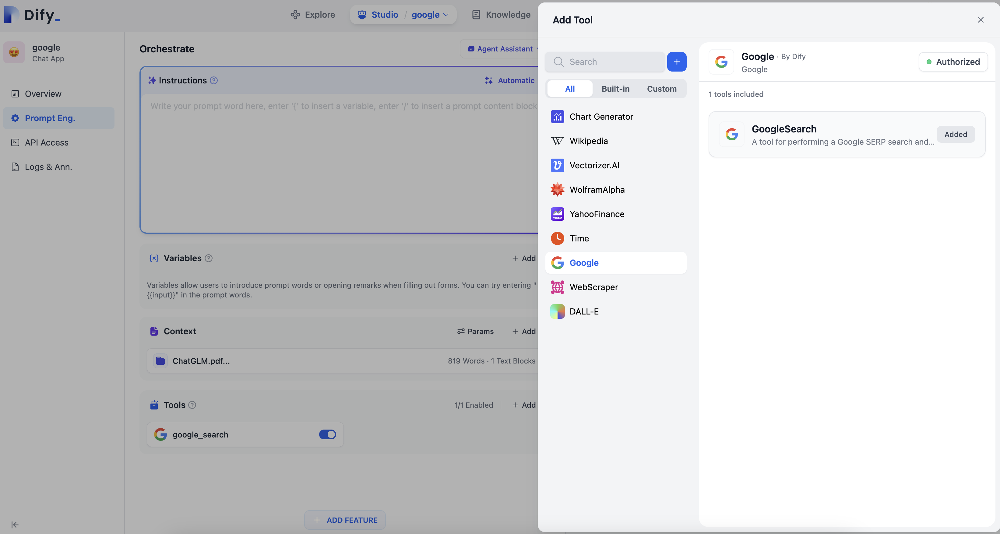

# ツールの迅速な統合

ここでは、GoogleSearchを例にツールを迅速に統合する方法を紹介します。

## 1. ツールプロバイダーのyamlを準備する

### 概要

このyamlファイルには、プロバイダー名、アイコン、作者などの詳細情報が含まれ、フロントエンドでの柔軟な表示を可能にします。

### 例

`core/tools/provider/builtin`の下に`google`モジュール（フォルダ）を作成し、`google.yaml`を作成します。名前はモジュール名と一致している必要があります。

以降、このツールに関するすべての操作はこのモジュール内で行います。

```yaml
identity: # ツールプロバイダーの基本情報
  author: Mlchain # 作者
  name: google # 名前（一意、他のプロバイダーと重複不可）
  label: # フロントエンド表示用のラベル
    en_US: Google # 英語ラベル
    zh_Hans: Google # 中国語ラベル
  description: # フロントエンド表示用の説明
    en_US: Google # 英語説明
    zh_Hans: Google # 中国語説明
  icon: icon.svg # アイコン（現在のモジュールの_assetsフォルダに配置）
  tags: # タグ（フロントエンド表示用）
    - search
```

- `identity`フィールドは必須で、ツールプロバイダーの基本情報（作者、名前、ラベル、説明、アイコンなど）が含まれます。
  - アイコンは現在のモジュールの`_assets`フォルダに配置する必要があります。[こちら](../../provider/builtin/google/_assets/icon.svg)を参照してください。
  - タグはフロントエンドでの表示に使用され、ユーザーがこのツールプロバイダーを素早く見つけるのに役立ちます。現在サポートされているすべてのタグは以下の通りです：
    ```python
    class ToolLabelEnum(Enum):
      SEARCH = 'search'
      IMAGE = 'image'
      VIDEOS = 'videos'
      WEATHER = 'weather'
      FINANCE = 'finance'
      DESIGN = 'design'
      TRAVEL = 'travel'
      SOCIAL = 'social'
      NEWS = 'news'
      MEDICAL = 'medical'
      PRODUCTIVITY = 'productivity'
      EDUCATION = 'education'
      BUSINESS = 'business'
      ENTERTAINMENT = 'entertainment'
      UTILITIES = 'utilities'
      OTHER = 'other'
    ```

## 2. プロバイダーの認証情報を準備する

GoogleはSerpApiが提供するAPIを使用するサードパーティツールであり、SerpApiを使用するにはAPI Keyが必要です。つまり、このツールを使用するには認証情報が必要です。一方、`wikipedia`のようなツールでは認証情報フィールドを記入する必要はありません。[こちら](../../provider/builtin/wikipedia/wikipedia.yaml)を参照してください。

認証情報フィールドを設定すると、以下のようになります：

```yaml
identity:
  author: Mlchain
  name: google
  label:
    en_US: Google
    zh_Hans: Google
  description:
    en_US: Google
    zh_Hans: Google
  icon: icon.svg
credentials_for_provider: # 認証情報フィールド
  serpapi_api_key: # 認証情報フィールド名
    type: secret-input # 認証情報フィールドタイプ
    required: true # 必須かどうか
    label: # 認証情報フィールドラベル
      en_US: SerpApi API key # 英語ラベル
      zh_Hans: SerpApi API key # 中国語ラベル
    placeholder: # 認証情報フィールドプレースホルダー
      en_US: Please input your SerpApi API key # 英語プレースホルダー
      zh_Hans: 请输入你的 SerpApi API key # 中国語プレースホルダー
    help: # 認証情報フィールドヘルプテキスト
      en_US: Get your SerpApi API key from SerpApi # 英語ヘルプテキスト
      zh_Hans: 从 SerpApi 获取您的 SerpApi API key # 中国語ヘルプテキスト
    url: https://serpapi.com/manage-api-key # 認証情報フィールドヘルプリンク
```

- `type`：認証情報フィールドタイプ。現在、`secret-input`、`text-input`、`select`の3種類をサポートしており、それぞれパスワード入力ボックス、テキスト入力ボックス、ドロップダウンボックスに対応します。`secret-input`の場合、フロントエンドで入力内容が隠され、バックエンドで入力内容が暗号化されます。

## 3. ツールのyamlを準備する

1つのプロバイダーの下に複数のツールを持つことができ、各ツールにはyamlファイルが必要です。このファイルにはツールの基本情報、パラメータ、出力などが含まれます。

引き続きGoogleSearchを例に、`google`モジュールの下に`tools`モジュールを作成し、`tools/google_search.yaml`を作成します。内容は以下の通りです：

```yaml
identity: # ツールの基本情報
  name: google_search # ツール名（一意、他のツールと重複不可）
  author: Mlchain # 作者
  label: # フロントエンド表示用のラベル
    en_US: GoogleSearch # 英語ラベル
    zh_Hans: 谷歌搜索 # 中国語ラベル
description: # フロントエンド表示用の説明
  human: # フロントエンド表示用の紹介（多言語対応）
    en_US: A tool for performing a Google SERP search and extracting snippets and webpages. Input should be a search query.
    zh_Hans: 一个用于执行 Google SERP 搜索并提取片段和网页的工具。输入应该是一个搜索查询。
  llm: A tool for performing a Google SERP search and extracting snippets and webpages. Input should be a search query. # LLMに渡す紹介文。LLMがこのツールをより理解できるよう、できるだけ詳細な情報を記述することをお勧めします。
parameters: # パラメータリスト
  - name: query # パラメータ名
    type: string # パラメータタイプ
    required: true # 必須かどうか
    label: # パラメータラベル
      en_US: Query string # 英語ラベル
      zh_Hans: 查询语句 # 中国語ラベル
    human_description: # フロントエンド表示用の紹介（多言語対応）
      en_US: used for searching
      zh_Hans: 用于搜索网页内容
    llm_description: key words for searching # LLMに渡す紹介文。LLMがこのパラメータをより理解できるよう、できるだけ詳細な情報を記述することをお勧めします。
    form: llm # フォームタイプ。llmはこのパラメータがAgentによって推論される必要があることを意味し、フロントエンドではこのパラメータは表示されません。
  - name: result_type
    type: select # パラメータタイプ
    required: true
    options: # ドロップダウンボックスのオプション
      - value: text
        label:
          en_US: text
          zh_Hans: 文本
      - value: link
        label:
          en_US: link
          zh_Hans: 链接
    default: link
    label:
      en_US: Result type
      zh_Hans: 结果类型
    human_description:
      en_US: used for selecting the result type, text or link
      zh_Hans: 用于选择结果类型，使用文本还是链接进行展示
    form: form # フォームタイプ。formはこのパラメータが対話開始前にフロントエンドでユーザーによって入力される必要があることを意味します。
```

- `identity`フィールドは必須で、ツールの基本情報（名前、作者、ラベル、説明など）が含まれます。
- `parameters` パラメータリスト
  - `name`（必須）パラメータ名。一意で、他のパラメータと重複しないようにしてください。
  - `type`（必須）パラメータタイプ。現在、`string`、`number`、`boolean`、`select`、`secret-input`の5種類をサポートしており、それぞれ文字列、数値、ブール値、ドロップダウンボックス、暗号化入力ボックスに対応します。機密情報には`secret-input`タイプの使用をお勧めします。
  - `label`（必須）パラメータラベル。フロントエンド表示用です。
  - `form`（必須）フォームタイプ。現在、`llm`と`form`の2種類をサポートしています。
    - エージェントアプリケーションでは、`llm`はこのパラメータがLLM自身によって推論されることを示し、`form`はこのツールを使用するために事前に設定できるパラメータであることを示します。
    - ワークフローアプリケーションでは、`llm`と`form`の両方がフロントエンドで入力する必要がありますが、`llm`のパラメータはツールノードの入力変数として使用されます。
  - `required` パラメータが必須かどうかを示します。
    - `llm`モードでは、パラメータが必須の場合、Agentはこのパラメータを推論する必要があります。
    - `form`モードでは、パラメータが必須の場合、ユーザーは対話開始前にフロントエンドでこのパラメータを入力する必要があります。
  - `options` パラメータオプション
    - `llm`モードでは、MlchainはすべてのオプションをLLMに渡し、LLMはこれらのオプションに基づいて推論できます。
    - `form`モードで、`type`が`select`の場合、フロントエンドはこれらのオプションを表示します。
  - `default` デフォルト値
  - `min` 最小値。パラメータタイプが`number`の場合に設定できます。
  - `max` 最大値。パラメータタイプが`number`の場合に設定できます。
  - `human_description` フロントエンド表示用の紹介。多言語対応です。
  - `placeholder` 入力ボックスのプロンプトテキスト。フォームタイプが`form`で、パラメータタイプが`string`、`number`、`secret-input`の場合に設定できます。多言語対応です。
  - `llm_description` LLMに渡す紹介文。LLMがこのパラメータをより理解できるよう、できるだけ詳細な情報を記述することをお勧めします。

## 4. ツールコードを準備する

ツールの設定が完了したら、ツールのロジックを実装するコードを作成します。

`google/tools`モジュールの下に`google_search.py`を作成し、内容は以下の通りです：

```python
from core.tools.tool.builtin_tool import BuiltinTool
from core.tools.entities.tool_entities import ToolInvokeMessage

from typing import Any, Dict, List, Union

class GoogleSearchTool(BuiltinTool):
    def _invoke(self, 
                user_id: str,
               tool_parameters: Dict[str, Any], 
        ) -> Union[ToolInvokeMessage, List[ToolInvokeMessage]]:
        """
            ツールを呼び出す
        """
        query = tool_parameters['query']
        result_type = tool_parameters['result_type']
        api_key = self.runtime.credentials['serpapi_api_key']
        result = SerpAPI(api_key).run(query, result_type=result_type)

        if result_type == 'text':
            return self.create_text_message(text=result)
        return self.create_link_message(link=result)
```

### パラメータ
ツールの全体的なロジックは`_invoke`メソッドにあります。このメソッドは2つのパラメータ（`user_id`とtool_parameters`）を受け取り、それぞれユーザーIDとツールパラメータを表します。

### 戻り値
ツールの戻り値として、1つのメッセージまたは複数のメッセージを選択できます。ここでは1つのメッセージを返しています。`create_text_message`と`create_link_message`を使用して、テキストメッセージまたはリンクメッセージを作成できます。複数のメッセージを返す場合は、リストを構築できます（例：`[self.create_text_message('msg1'), self.create_text_message('msg2')]`）。

## 5. プロバイダーコードを準備する

最後に、プロバイダーモジュールの下にプロバイダークラスを作成し、プロバイダーの認証情報検証ロジックを実装する必要があります。認証情報の検証が失敗した場合、`ToolProviderCredentialValidationError`例外が発生します。

`google`モジュールの下に`google.py`を作成し、内容は以下の通りです：

```python
from core.tools.provider.builtin_tool_provider import BuiltinToolProviderController
from core.tools.errors import ToolProviderCredentialValidationError

from core.tools.provider.builtin.google.tools.google_search import GoogleSearchTool

from typing import Any, Dict

class GoogleProvider(BuiltinToolProviderController):
    def _validate_credentials(self, credentials: Dict[str, Any]) -> None:
        try:
            # 1. ここでGoogleSearchTool()を使ってGoogleSearchToolをインスタンス化する必要があります。これによりGoogleSearchToolのyaml設定が自動的に読み込まれますが、この時点では認証情報は含まれていません
            # 2. 次に、fork_tool_runtimeメソッドを使用して、現在の認証情報をGoogleSearchToolに渡す必要があります
            # 3. 最後に、invokeを呼び出します。パラメータはGoogleSearchToolのyamlで設定されたパラメータルールに従って渡す必要があります
            GoogleSearchTool().fork_tool_runtime(
                meta={
                    "credentials": credentials,
                }
            ).invoke(
                user_id='',
                tool_parameters={
                    "query": "test",
                    "result_type": "link"
                },
            )
        except Exception as e:
            raise ToolProviderCredentialValidationError(str(e))
```

## 完了

以上のステップが完了すると、このツールをフロントエンドで確認し、Agentで使用することができるようになります。

もちろん、google_searchには認証情報が必要なため、使用する前にフロントエンドで認証情報を入力する必要があります。

